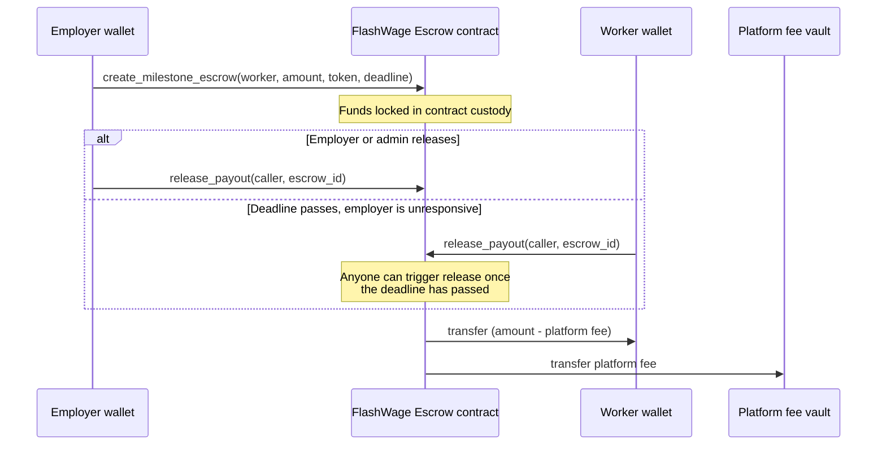

# FlashWage

Milestone-based escrow and instant payouts for gig work, built on Stellar and Soroban.

The problem this is chipping away at: a freelancer in Lagos finishes a milestone for a client in Berlin, and then waits. Bank wires take days, cut 3-6% in fees, and go through at least one correspondent bank that has no idea who either of them are. FlashWage puts the payment terms on-chain instead — the employer locks funds up front, the worker gets paid in seconds once the milestone is released, and Stellar's Path Payments let that payout land as a local stablecoin (ARS, BRL, EURC, whatever's usable where the worker actually lives) instead of sitting in USDC they now have to off-ramp themselves.

## Where things stand

- **A working, tested Soroban escrow contract** (`contracts/flashwage_escrow`) — 16 unit tests, builds clean to a deployable `.wasm`.
- **A working Next.js frontend** (`frontend/`) — employer dashboard, worker portal, and landing page with a live TVL/disbursement banner. It builds, typechecks, and lints clean, and renders correctly against a locally running dev server.
- **Not yet done:** nobody has deployed the contract to a live network and clicked through the UI against it with an actual Freighter wallet. The frontend code talks to the contract exactly the way `stellar contract invoke` does in the CLI walkthrough below, but "the TypeScript compiles" and "a real transaction round-trips through Freighter and the RPC" are different claims — only the first one has been verified so far. If you deploy this and hit something that doesn't work end-to-end, that's exactly the kind of report that's useful — open an issue.

I'd rather the README describe what actually exists than read like a pitch deck, so the sections below say what's been run, not just what's been written.

## How the escrow works



If the deadline passes and nobody has released the funds, the employer can instead call `cancel_escrow` to get a full refund — but only after the deadline, so an employer can't unilaterally yank funds out from under a worker who's still mid-milestone.

## Repo layout

```
flashwage/
├── contracts/
│   └── flashwage_escrow/   # Soroban contract: escrow, split payouts, deadlines
│       ├── src/lib.rs      # contract logic, documented inline
│       └── src/test.rs     # 16 unit tests covering the auth/deadline matrix
├── frontend/               # Next.js app (App Router, TypeScript, Tailwind)
│   ├── src/app/            # landing page, /employer, /worker routes
│   ├── src/components/     # wallet connect, escrow cards, withdraw flow, ...
│   └── src/lib/            # Freighter wallet, contract client, Path Payment helpers
├── docs/                   # longer-form notes, architecture decisions
├── rust-toolchain.toml     # pins the compiler + wasm target the contract needs
└── Cargo.toml              # workspace root
```

## Getting the contract running locally

You'll need Rust (the toolchain is pinned in `rust-toolchain.toml`, so `rustup` will pick the right one automatically) and the Stellar CLI.

```bash
# 1. Install the Stellar CLI if you don't have it.
#    (This used to be called soroban-cli — same tool, new name.)
cargo install --locked stellar-cli

# 2. Clone and build.
git clone https://github.com/<your-org>/flashwage.git
cd flashwage
cargo build -p flashwage-escrow --target wasm32v1-none --release

# 3. Run the test suite.
cargo test -p flashwage-escrow
```

That should give you a green run of 16 tests and a `.wasm` file at `target/wasm32v1-none/release/flashwage_escrow.wasm`.

### Deploying to testnet

```bash
# Generate (or reuse) a funded testnet identity.
stellar keys generate admin --network testnet --fund

# Deploy the built wasm.
stellar contract deploy \
  --wasm target/wasm32v1-none/release/flashwage_escrow.wasm \
  --source admin \
  --network testnet

# Initialize it (swap in the deployed contract ID and a real testnet USDC address).
stellar contract invoke \
  --id <CONTRACT_ID> \
  --source admin \
  --network testnet \
  -- initialize \
  --admin <ADMIN_ADDRESS> \
  --accepted_assets '["<USDC_TOKEN_ADDRESS>"]' \
  --platform_fee_bps 50 \
  --fee_vault <FEE_VAULT_ADDRESS>
```

`platform_fee_bps` is in basis points, so `50` = 0.5%. The contract hard-caps this at 1000 (10%) regardless of what the admin passes in, so a compromised or careless admin key can't quietly set the fee to something absurd.

### Frontend

```bash
cd frontend
npm install
cp .env.local.example .env.local   # then fill in the values below
npm run dev
```

Open `http://localhost:3000`. The landing page's stat cards and both `/employer` and `/worker` render fine with an empty `.env.local` (they just show "Contract not connected" instead of numbers) — but creating or acting on an escrow needs:

- `NEXT_PUBLIC_ESCROW_CONTRACT_ID` — the `C...` address from `stellar contract deploy` above.
- `NEXT_PUBLIC_USDC_CONTRACT_ID` — the Soroban-side (`C...`) address of whatever token you passed to `initialize` as an accepted asset.
- `NEXT_PUBLIC_USDC_ASSET_CODE` / `NEXT_PUBLIC_USDC_ASSET_ISSUER` — that *same* asset's classic-layer code and `G...` issuer. A Stellar Asset Contract is just the Soroban-side view of a classic asset, and the worker's Path Payment withdrawal operates on the classic trustline balance, so it needs the classic form even though contract calls need the `C...` form.
- The [Freighter browser extension](https://freighter.app), pointed at the same network as `NEXT_PUBLIC_NETWORK_PASSPHRASE`.

Local off-ramp currencies (ARS/BRL/EURC) are optional — leave an issuer blank in `.env.local` and that currency just won't show up in the worker's withdrawal dropdown. All of this is documented inline in `.env.local.example`.

`npm run build` and `npm run lint` are both clean as of this commit; that's the level of verification this frontend has actually had — see "Where things stand" above for what hasn't been tested yet.

## Contract interface

| Function | Who can call it | What it does |
|---|---|---|
| `initialize` | admin (once) | Sets accepted tokens, platform fee, fee vault |
| `create_milestone_escrow` | employer | Locks `amount` of an accepted token, creates an escrow for a worker |
| `release_payout` | employer, admin, or *anyone* once the deadline has passed | Pays the worker, splits the platform fee to the vault |
| `cancel_escrow` | employer, only after the deadline | Refunds the locked amount to the employer |
| `get_escrow` / `get_config` / `get_escrow_count` | anyone (read-only) | Fetch escrow, platform, or counter state for the dashboards |

There's no on-chain index of "escrows belonging to address X" — the frontend enumerates `0..get_escrow_count()` and filters client-side (see `frontend/src/lib/contract.ts`). That's fine at the scale an early-stage platform actually has; it's the first thing to replace with a real events-indexing backend once it isn't.

The "anyone can release after the deadline" rule is deliberate, not an oversight — it exists so a worker's payout can never be permanently stuck behind an employer who's gone quiet.

## Testing

```bash
cargo test -p flashwage-escrow
```

Covers initialization (including double-init and an over-the-cap fee getting rejected), fee-split math on release, the auto-release-after-deadline path triggered by a non-employer/admin caller, unauthorized early release, cancel-before-deadline being rejected, and a few not-found/invalid-input edge cases. If you're adding a new code path to the contract, add a test alongside it — see [CONTRIBUTING.md](CONTRIBUTING.md) for the specifics.

## Roadmap

- [x] Milestone escrow contract — lock, split-release, deadline-gated cancel
- [x] Employer dashboard (Freighter connect, create/manage escrows)
- [x] Worker payout portal (view milestones, withdraw via Path Payment to a local stablecoin)
- [x] TVL / disbursement / settlement-time metrics banner
- [ ] First live testnet deployment + an actual click-through with Freighter (see "Where things stand")
- [ ] Passkey wallet support alongside Freighter
- [ ] Multi-sig / contract upgrade path for the admin role
- [ ] Real events-based (or indexed) escrow lookup, replacing the client-side `0..count` scan

## Contributing

Bug reports, contract review, and frontend help are all welcome — see [CONTRIBUTING.md](CONTRIBUTING.md) for coding conventions, PR expectations, and a milestone breakdown aimed at people picking this up through Drips, the Stellar Community Fund, GrantFox, or Gitcoin.

## License

MIT — see [LICENSE](LICENSE).
