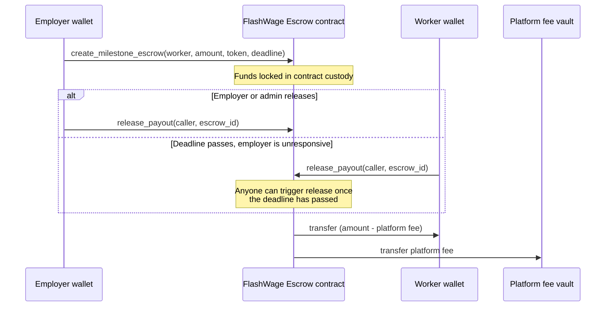

# FlashWage

Milestone-based escrow and instant payouts for gig work, built on Stellar and Soroban.

The problem this is chipping away at: a freelancer in Lagos finishes a milestone for a client in Berlin, and then waits. Bank wires take days, cut 3-6% in fees, and go through at least one correspondent bank that has no idea who either of them are. FlashWage puts the payment terms on-chain instead — the employer locks funds up front, the worker gets paid in seconds once the milestone is released, and Stellar's Path Payments let that payout land as a local stablecoin (ARS, BRL, EURC, whatever's usable where the worker actually lives) instead of sitting in USDC they now have to off-ramp themselves.

## Where things stand

This is early. Right now the repo has:

- **A working, tested Soroban escrow contract** (`contracts/flashwage_escrow`) — this is done and is what's under review before the frontend gets built.
- **Nothing yet in `/frontend`.** The Next.js employer dashboard and worker portal described below are the next milestone, not something you can run today.

I'd rather the README describe what actually exists than read like a pitch deck, so treat the "Frontend" section as a spec for what's coming, not a changelog of what's shipped.

## How the escrow works



If the deadline passes and nobody has released the funds, the employer can instead call `cancel_escrow` to get a full refund — but only after the deadline, so an employer can't unilaterally yank funds out from under a worker who's still mid-milestone.

## Repo layout

```
flashwage/
├── contracts/
│   └── flashwage_escrow/   # Soroban contract: escrow, split payouts, deadlines
│       ├── src/lib.rs      # contract logic, documented inline
│       └── src/test.rs     # 15 unit tests covering the auth/deadline matrix
├── frontend/               # Next.js app — not started yet
├── docs/                   # longer-form notes, architecture decisions
├── rust-toolchain.toml     # pins the compiler + wasm target the contract needs
└── Cargo.toml              # workspace root
```

## Getting the contract running locally

You'll need Rust (the toolchain is pinned in `rust-toolchain.toml`, so `rustup` will pick the right one automatically) and the Stellar CLI.

```bash
# 1. Install the Stellar CLI if you don't have it.
#    (This used to be called soroban-cli — same tool, new name.)
cargo install --locked stellar-cli

# 2. Clone and build.
git clone https://github.com/<your-org>/flashwage.git
cd flashwage
cargo build -p flashwage-escrow --target wasm32v1-none --release

# 3. Run the test suite.
cargo test -p flashwage-escrow
```

That should give you a green run of 15 tests and a `.wasm` file at `target/wasm32v1-none/release/flashwage_escrow.wasm`.

### Deploying to testnet

```bash
# Generate (or reuse) a funded testnet identity.
stellar keys generate admin --network testnet --fund

# Deploy the built wasm.
stellar contract deploy \
  --wasm target/wasm32v1-none/release/flashwage_escrow.wasm \
  --source admin \
  --network testnet

# Initialize it (swap in the deployed contract ID and a real testnet USDC address).
stellar contract invoke \
  --id <CONTRACT_ID> \
  --source admin \
  --network testnet \
  -- initialize \
  --admin <ADMIN_ADDRESS> \
  --accepted_assets '["<USDC_TOKEN_ADDRESS>"]' \
  --platform_fee_bps 50 \
  --fee_vault <FEE_VAULT_ADDRESS>
```

`platform_fee_bps` is in basis points, so `50` = 0.5%. The contract hard-caps this at 1000 (10%) regardless of what the admin passes in, so a compromised or careless admin key can't quietly set the fee to something absurd.

### Frontend (coming soon)

Once the frontend milestone lands, this section will have real `npm install && npm run dev` instructions for the employer dashboard and worker portal. Until then, the contract can be exercised directly through `stellar contract invoke` as shown above.

## Contract interface

| Function | Who can call it | What it does |
|---|---|---|
| `initialize` | admin (once) | Sets accepted tokens, platform fee, fee vault |
| `create_milestone_escrow` | employer | Locks `amount` of an accepted token, creates an escrow for a worker |
| `release_payout` | employer, admin, or *anyone* once the deadline has passed | Pays the worker, splits the platform fee to the vault |
| `cancel_escrow` | employer, only after the deadline | Refunds the locked amount to the employer |
| `get_escrow` / `get_config` | anyone (read-only) | Fetch escrow or platform state for the dashboards |

The "anyone can release after the deadline" rule is deliberate, not an oversight — it exists so a worker's payout can never be permanently stuck behind an employer who's gone quiet.

## Testing

```bash
cargo test -p flashwage-escrow
```

Covers initialization (including double-init and an over-the-cap fee getting rejected), fee-split math on release, the auto-release-after-deadline path triggered by a non-employer/admin caller, unauthorized early release, cancel-before-deadline being rejected, and a few not-found/invalid-input edge cases. If you're adding a new code path to the contract, add a test alongside it — see [CONTRIBUTING.md](CONTRIBUTING.md) for the specifics.

## Roadmap

- [x] Milestone escrow contract — lock, split-release, deadline-gated cancel
- [ ] Employer dashboard (Freighter connect, create/manage escrows)
- [ ] Worker payout portal (view milestones, withdraw via Path Payment to a local stablecoin)
- [ ] TVL / disbursement / settlement-time metrics banner
- [ ] Passkey wallet support alongside Freighter
- [ ] Multi-sig / contract upgrade path for the admin role

## Contributing

Bug reports, contract review, and frontend help are all welcome — see [CONTRIBUTING.md](CONTRIBUTING.md) for coding conventions, PR expectations, and a milestone breakdown aimed at people picking this up through Drips, the Stellar Community Fund, GrantFox, or Gitcoin.

## License

MIT — see [LICENSE](LICENSE).
