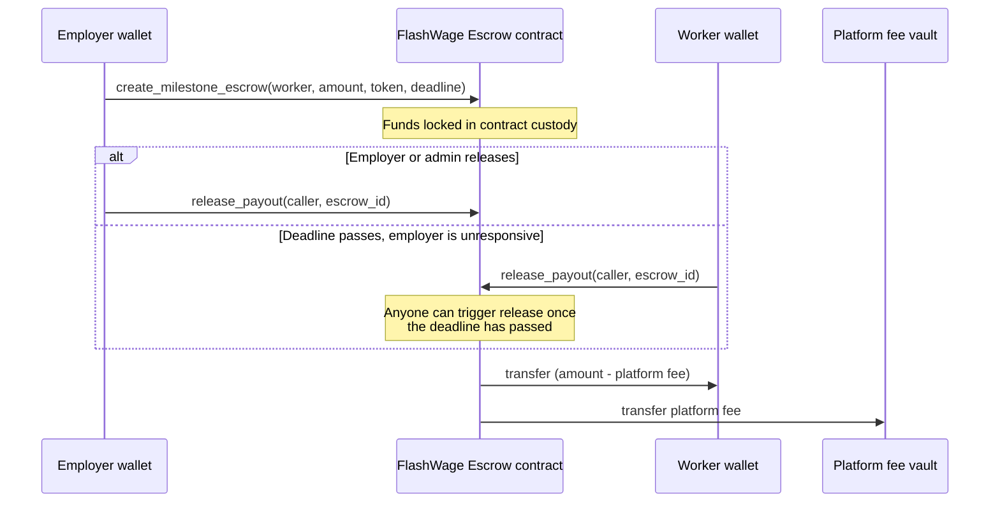

# FlashWage

[](https://github.com/gidanzaki/flashwage/actions/workflows/ci.yml)

Milestone-based escrow and instant payouts for gig work, built on Stellar and Soroban.

The problem this is chipping away at: a freelancer in Lagos finishes a milestone for a client in Berlin, and then waits. Bank wires take days, cut 3-6% in fees, and go through at least one correspondent bank that has no idea who either of them are. FlashWage puts the payment terms on-chain instead — the employer locks funds up front, the worker gets paid in seconds once the milestone is released, and Stellar's Path Payments let that payout land as a local stablecoin (ARS, BRL, EURC, whatever's usable where the worker actually lives) instead of sitting in USDC they now have to off-ramp themselves.

## Where things stand

- **A working, tested Soroban escrow contract** (`contracts/flashwage_escrow`) — 17 unit tests, `cargo clippy -D warnings` clean, builds to a deployable `.wasm`. Went through one internal security self-review pass (see [SECURITY.md](SECURITY.md)) that caught and fixed a checks-effects-interactions ordering issue before it shipped anywhere.
- **A working Next.js frontend** (`frontend/`) — employer dashboard, worker portal, and landing page with a live TVL/disbursement banner. 33 unit tests on the sharpest-edged logic (bigint/decimal amount conversion, the contract's on-chain status decoding). Builds, typechecks, and lints clean.
- **CI** (`.github/workflows/ci.yml`) runs all of the above — contract fmt/clippy/test/build and frontend lint/test/build — on every push and PR.
- **Deployed and exercised end-to-end on testnet** — not just simulated. A real escrow was created, released, and read back through the frontend's actual `contract.ts` code (not a reimplementation), and it caught a real bug: see "Live on testnet" below.

I'd rather the README describe what actually exists than read like a pitch deck, so the sections below say what's been run, not just what's been written.

## How the escrow works



If the deadline passes and nobody has released the funds, the employer can instead call `cancel_escrow` to get a full refund — but only after the deadline, so an employer can't unilaterally yank funds out from under a worker who's still mid-milestone.

## Live on testnet

A real instance is deployed and initialized on Stellar testnet, accepting the native XLM Stellar Asset Contract as its (only, for now) token — using the native asset instead of a custom USDC issuance means it needed zero setup on top of a funded testnet account, so this can be redeployed identically by anyone.

```
Contract ID: CAT4NSNCSHGLUOLIEWB2AIGEJP3K4PBJPSORH4VBQUIHEMJK5IBYLOQN
Network:     Test SDF Network ; September 2015
Accepted asset (native XLM SAC): CDLZFC3SYJYDZT7K67VZ75HPJVIEUVNIXF47ZG2FB2RMQQVU2HHGCYSC
```

You can point `frontend/.env.local` at this right now (`NEXT_PUBLIC_ESCROW_CONTRACT_ID` + `NEXT_PUBLIC_USDC_CONTRACT_ID` both set to the values above, `NEXT_PUBLIC_USDC_ASSET_CODE=native`) and see real, previously-created escrows render in the UI. This is a testnet demo deployment, not a production commitment — it may get redeployed or reset as the contract changes.

**What actually got verified against it**, via `stellar contract invoke` and by calling the frontend's own `lib/contract.ts` functions directly against the live RPC (not a reimplementation, not mocked):

- `initialize`, `create_milestone_escrow`, `release_payout`, `get_escrow`, `get_escrow_count` all executed as real signed transactions and settled.
- The fee split happened correctly on-chain: a 10 XLM escrow released 9.95 XLM to the worker and 0.05 XLM to the fee vault — exactly the 0.5% configured, verified against the worker's actual Horizon balance before and after, not just the contract's return value.
- The frontend's read path (`fetchConfig`, `fetchEscrow`, `fetchEscrowCount`, `fetchEscrowsForAddress`) and write path (`createMilestoneEscrow`) both round-tripped correctly through the real RPC.

**This is also where a real bug turned up.** `lib/contract.ts` originally read a Result-returning contract call's `.result` as the value directly. Against a live contract, every such call (`get_escrow`, `get_config`, `create_milestone_escrow`, `release_payout`, `cancel_escrow` — everything except `get_escrow_count`, which isn't `Result`-typed) actually returns a `Result<T, Error>` wrapper object (`.unwrap()` / `.isOk()` / `.isErr()`), not `T` directly — a real, documented `@stellar/stellar-sdk` contract-client behavior that no amount of type-checking or unit testing against mocked data would have caught, because the mock would have encoded the same wrong assumption. Fixed by unwrapping properly at every call site. This is exactly the class of bug "the frontend was never tested against a live contract" predicts, and exactly why that gap mattered more than a clean `npm run build`.

Separately, this pass also turned up and fixed a **critical unauthenticated RCE** in the pinned Next.js version (`GHSA-p293-qw3h-jr36`, fixed in 16.3.5) and a high-severity `js-yaml` issue, both via `npm audit` — unrelated to the contract work, but the kind of thing that only surfaces when someone actually runs the tooling instead of leaving a lockfile untouched.

## Repo layout

```
flashwage/
├── .github/workflows/ci.yml  # fmt/clippy/test/build + lint/test/build, on every push/PR
├── contracts/
│   └── flashwage_escrow/   # Soroban contract: escrow, split payouts, deadlines
│       ├── src/lib.rs      # contract logic, documented inline
│       └── src/test.rs     # 17 unit tests covering the auth/deadline matrix
├── frontend/               # Next.js app (App Router, TypeScript, Tailwind)
│   ├── src/app/            # landing page, /employer, /worker routes
│   ├── src/components/     # wallet connect, escrow cards, withdraw flow, ...
│   └── src/lib/            # Freighter wallet, contract client, Path Payment helpers
├── docs/                   # longer-form notes, architecture decisions
├── SECURITY.md             # self-review log, known accepted risks, how to report a vuln
├── rust-toolchain.toml     # pins the compiler + wasm target the contract needs
└── Cargo.toml              # workspace root
```

## Getting the contract running locally

You'll need Rust (the toolchain is pinned in `rust-toolchain.toml`, so `rustup` will pick the right one automatically) and the Stellar CLI.

```bash
# 1. Install the Stellar CLI if you don't have it.
#    (This used to be called soroban-cli — same tool, new name.)
cargo install --locked stellar-cli

# 2. Clone and build.
git clone https://github.com/gidanzaki/flashwage.git
cd flashwage
cargo build -p flashwage-escrow --target wasm32v1-none --release

# 3. Run the test suite.
cargo test -p flashwage-escrow
```

That should give you a green run of 17 tests and a `.wasm` file at `target/wasm32v1-none/release/flashwage_escrow.wasm`.

### Deploying to testnet

```bash
# Generate (or reuse) a funded testnet identity.
stellar keys generate admin --network testnet --fund

# Deploy the built wasm.
stellar contract deploy \
  --wasm target/wasm32v1-none/release/flashwage_escrow.wasm \
  --source admin \
  --network testnet

# Initialize it (swap in the deployed contract ID and a real testnet USDC address).
stellar contract invoke \
  --id <CONTRACT_ID> \
  --source admin \
  --network testnet \
  -- initialize \
  --admin <ADMIN_ADDRESS> \
  --accepted_assets '["<USDC_TOKEN_ADDRESS>"]' \
  --platform_fee_bps 50 \
  --fee_vault <FEE_VAULT_ADDRESS>
```

`platform_fee_bps` is in basis points, so `50` = 0.5%. The contract hard-caps this at 1000 (10%) regardless of what the admin passes in, so a compromised or careless admin key can't quietly set the fee to something absurd.

### Frontend

```bash
cd frontend
npm install
cp .env.local.example .env.local   # then fill in the values below
npm run dev
```

Open `http://localhost:3000`. The landing page's stat cards and both `/employer` and `/worker` render fine with an empty `.env.local` (they just show "Contract not connected" instead of numbers) — but creating or acting on an escrow needs:

- `NEXT_PUBLIC_ESCROW_CONTRACT_ID` — the `C...` address from `stellar contract deploy` above.
- `NEXT_PUBLIC_USDC_CONTRACT_ID` — the Soroban-side (`C...`) address of whatever token you passed to `initialize` as an accepted asset.
- `NEXT_PUBLIC_USDC_ASSET_CODE` / `NEXT_PUBLIC_USDC_ASSET_ISSUER` — that *same* asset's classic-layer code and `G...` issuer. A Stellar Asset Contract is just the Soroban-side view of a classic asset, and the worker's Path Payment withdrawal operates on the classic trustline balance, so it needs the classic form even though contract calls need the `C...` form.
- The [Freighter browser extension](https://freighter.app), pointed at the same network as `NEXT_PUBLIC_NETWORK_PASSPHRASE`.

Local off-ramp currencies (ARS/BRL/EURC) are optional — leave an issuer blank in `.env.local` and that currency just won't show up in the worker's withdrawal dropdown. All of this is documented inline in `.env.local.example`.

`npm run build`, `npm run lint`, and `npm run test` are all clean as of this commit, and the contract-talking code (`lib/contract.ts`'s reads and writes) has been exercised against a real deployed contract — see "Live on testnet" above. What's still unverified is specifically the browser/Freighter half: nobody has clicked the UI's own buttons with the extension installed, as opposed to calling the same underlying functions directly the way that verification did.

## Contract interface

| Function | Who can call it | What it does |
|---|---|---|
| `initialize` | admin (once) | Sets accepted tokens, platform fee, fee vault |
| `create_milestone_escrow` | employer | Locks `amount` of an accepted token, creates an escrow for a worker |
| `release_payout` | employer, admin, or *anyone* once the deadline has passed | Pays the worker, splits the platform fee to the vault |
| `cancel_escrow` | employer, only after the deadline | Refunds the locked amount to the employer |
| `get_escrow` / `get_config` / `get_escrow_count` | anyone (read-only) | Fetch escrow, platform, or counter state for the dashboards |

There's no on-chain index of "escrows belonging to address X" — the frontend enumerates `0..get_escrow_count()` and filters client-side (see `frontend/src/lib/contract.ts`). That's fine at the scale an early-stage platform actually has; it's the first thing to replace with a real events-indexing backend once it isn't.

The "anyone can release after the deadline" rule is deliberate, not an oversight — it exists so a worker's payout can never be permanently stuck behind an employer who's gone quiet.

## Testing

```bash
cargo test -p flashwage-escrow      # contract: 17 tests
cd frontend && npm run test          # frontend: 33 tests
```

The contract suite covers initialization (including double-init, an over-the-cap fee, and too many accepted assets all getting rejected), fee-split math on release, the auto-release-after-deadline path triggered by a non-employer/admin caller, unauthorized early release, and cancel-before-deadline being rejected.

The frontend suite is narrower and deliberately aimed at the two places a silent bug would be most damaging: `lib/format.ts`'s bigint↔decimal-string conversion (every amount that crosses the wallet/contract boundary goes through this) and `lib/contract.ts`'s raw-ScVal-to-native decoding (in particular the `EscrowStatus` enum, whose wire format was confirmed by reading the `soroban-sdk-macros` source directly rather than assumed). It doesn't yet cover the wallet-connection or Path Payment flows, which need a browser and a live RPC to exercise meaningfully.

Both suites, plus lint and the wasm build, run in CI (`.github/workflows/ci.yml`) on every push and PR. If you're adding a new code path, add a test alongside it — see [CONTRIBUTING.md](CONTRIBUTING.md) for the specifics.

## Roadmap

- [x] Milestone escrow contract — lock, split-release, deadline-gated cancel
- [x] Employer dashboard (Freighter connect, create/manage escrows)
- [x] Worker payout portal (view milestones, withdraw via Path Payment to a local stablecoin)
- [x] TVL / disbursement / settlement-time metrics banner
- [x] CI (contract fmt/clippy/test/build + frontend lint/test/build) on every push/PR
- [x] Frontend unit test coverage for the bigint/decimal and ScVal-decoding logic
- [x] One internal contract security self-review pass (see [SECURITY.md](SECURITY.md))
- [x] First live testnet deployment, contract calls verified end-to-end (see "Live on testnet")
- [ ] An actual browser click-through with the Freighter extension installed (everything so far has called the same underlying functions directly, not through the UI's buttons)
- [ ] Passkey wallet support alongside Freighter
- [ ] Multi-sig / contract upgrade path for the admin role
- [ ] Real events-based (or indexed) escrow lookup, replacing the client-side `0..count` scan

## Contributing

Bug reports, contract review, and frontend help are all welcome — see [CONTRIBUTING.md](CONTRIBUTING.md) for coding conventions, PR expectations, and a milestone breakdown aimed at people picking this up through Drips, the Stellar Community Fund, GrantFox, or Gitcoin.

## Security

See [SECURITY.md](SECURITY.md) for the self-review log, known accepted risks, and how to report a vulnerability.

## License

MIT — see [LICENSE](LICENSE).
